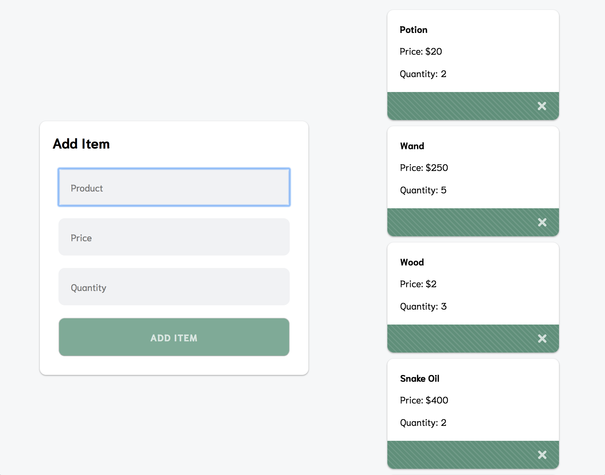

# shopping-cart-database
Create a database for shopping cart app, with front-end functionality

Build Specifications
Server Side
1. In pgAdmin, create a database called "ExpressShopDB" and a table called "ShoppingCart". The table will have columns: if, product, price, and quantity.
2. Construct the connection file that will contain all of the information allowing the server to communicate with the database.
3. Create GET, POST, PUT, and DELETE  requests in routes module to include the appropriate queries for each of the four requests.
4. Test endpoints with Postman.

Angular Side
5. Update the CartService to call all four of your API endpoints. Add methods to add, remove, and update items.
6. Expand the UI to handle these operations.

